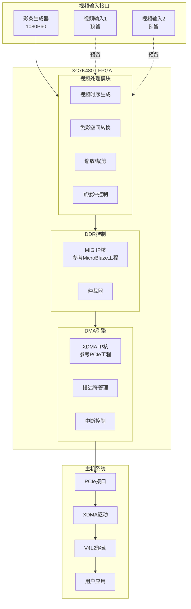
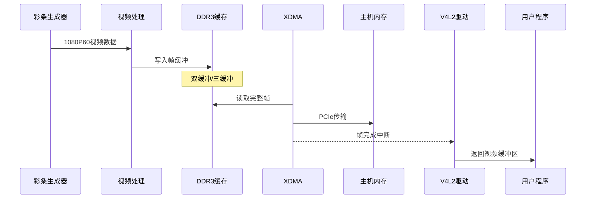
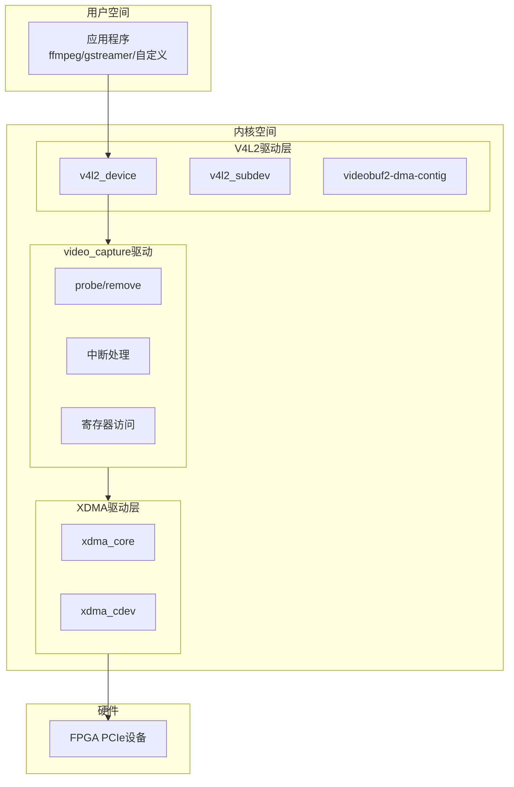
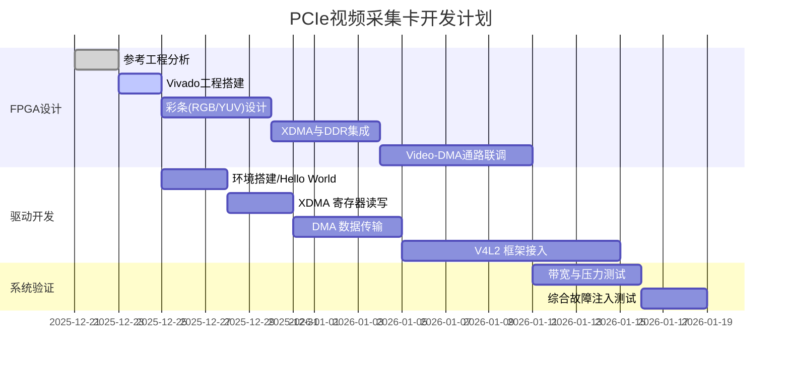

# PCIe视频采集卡设计方案

## 1. 项目概述

### 1.1 目标
设计一款基于Xilinx XC7K480TFFG1156-2 FPGA的PCIe视频采集卡，支持多路视频输入，通过PCIe接口与主机通信，在Linux系统下提供V4L2标准驱动接口。

### 1.2 硬件平台
| 项目 | 规格 |
|------|------|
| FPGA芯片 | XC7K480TFFG1156-2 (Kintex-7) |
| PCIe版本 | PCIe Gen2 x8 (参考XC7K480T_PCIE_Test_ex) |
| 开发工具 | Vivado 2024.2 |
| 参考工程 | XC7K480T_PCIE_Test_ex (XDMA例程) |
| 管脚约束参考 | XC7K480T_MicroBlaze_Test (DDR测试工程) |
| 初始视频源 | 彩条测试图案 (1080P60) |

### 1.3 设计要点
- **视频输入**: 前期测试阶段使用内部彩条生成器，支持RGB或YUV422格式，1080P60 (1920x1080@60fps)
- **多路预留**: 架构设计支持多路视频输入，初期实现单路
- **PCIe接口**: 基于XDMA IP核，参考XC7K480T_PCIE_Test_ex工程配置，优化中断和DMA配置
- **DDR缓存**: 参考XC7K480T_MicroBlaze_Test的MIG配置，确保读写带宽
- **系统可靠性**: 增加完整的错误处理、状态监控和调试接口规划

---

## 2. 系统架构

### 2.1 整体架构图



### 2.2 数据流架构



### 2.3 带宽预算分析
- **视频源带宽**:
  - 1080P60 @ RGB888: 1920 × 1080 × 60 × 3 ≈ 373 MB/s
  - 1080P60 @ YUV422: 1920 × 1080 × 60 × 2 ≈ 249 MB/s
  - 双缓冲读写总需求: ~750 MB/s (RGB888 case)
- **PCIe带宽**:
  - Gen2 x8 理论带宽: 4.0 GB/s
  - 有效传输带宽 (保守估计 70%): ~2.8 GB/s
  - 裕量: > 7倍视频带宽，非常充足
- **DDR3带宽**:
  - 64-bit @ 800MHz (1600MT/s)
  - 理论峰值: 12.8 GB/s
  - 有效带宽 (保守估计 60%): ~7.6 GB/s
  - 裕量: > 10倍视频带宽，满足多路扩展需求

### 2.4 错误处理机制
- **硬件层**:
  - **FIFO溢出/下溢**: 状态寄存器标志位记录异常，可触发中断
  - **PCIe链路丢失**: 监控`user_lnk_up`信号，通过LED指示
  - **DDR校准失败**: 监控`init_calib_complete`，LED指示及状态寄存器反馈
- **驱动层**:
  - **DMA超时**: 设置DMA传输超时定时器
  - **Magic Number校验**: 帧头/帧尾添加特征码，防止数据错位
- **恢复策略**:
  - 支持软件复位 (Soft Reset)，可单独复位视频处理通路而不复位PCIe链路

---

## 3. FPGA逻辑设计

### 3.1 IP核配置

#### 3.1.1 XDMA IP核 (参考XC7K480T_PCIE_Test_ex)
```
Configuration:
- Basic:
  - PCIe Block Location: X0Y0
  - Lane Width: x8
  - Maximum Link Speed: 5.0 GT/s (Gen2)
  - Reference Clock Frequency: 100 MHz
  - AXI Data Width: 256-bit
  - AXI Clock Frequency: 250 MHz (Automatic)
- DMA:
  - Number of DMA Read Channels: 2 (H2C)
  - Number of DMA Write Channels: 2 (C2H)
  - DMA Interface: AXI4-Stream (Stream模式更适合视频流)
- Interrupts:
  - Legacy Interrupt: None
  - MSI-X: Enabled
  - User Interrupts: 4 (Frame Start, Frame End, Error, Reserved)
- Address Translation:
  - BAR0: AXI Lite Master (64KB, for Registers)
```
*改进说明*: 明确使用Stream接口模式，启用4个用户中断用于精确的帧同步和错误上报。

#### 3.1.2 MIG IP核 (参考XC7K480T_MicroBlaze_Test)
```
Configuration:
- Memory Part: 根据实际硬件配置
- Data Width: 64-bit (可扩展到128-bit)
- ECC: 可选
- Clock Period: 根据实际配置
- AXI Interface: AXI4
```

#### 3.1.3 彩条生成器 (Video Pattern Generator)
```
功能:
- 前期测试输入源
- 支持 1080P60 时序 (1920x1080@60fps)
- 支持格式切换: 
  - RGB888 (24-bit)
  - YUV422 (16-bit)
- 动态控制:
  - 模式切换 (Color Bar, Pure Color, Gradient)
  - 动态开关
```

### 3.2 模块设计

#### 3.2.1 模块层次结构
```
video_cap_top
├── xdma_0                    # XDMA IP核 (参考PCIe工程)
├── mig_7series_0             # DDR3控制器 (参考MicroBlaze工程)
├── axi_interconnect          # AXI互联
├── video_pattern_gen         # 彩条生成器 (新设计)
│   ├── timing_gen            # 时序生成 (1080P60)
│   ├── color_bar_gen         # 彩条图案生成
│   └── vid_to_axi_stream     # 视频转AXI-Stream
├── video_input_subsystem     # 视频输入子系统 (预留多路)
│   ├── video_channel_0       # 通道0 (彩条)
│   ├── video_channel_1       # 通道1 (预留)
│   └── video_channel_2       # 通道2 (预留)
├── video_processing          # 视频处理模块
│   ├── axi_stream_fifo       # 异步FIFO
│   ├── color_space_conv      # 色彩空间转换
│   └── video_scaler          # 视频缩放
├── frame_buffer_ctrl         # 帧缓冲控制
│   ├── write_master          # DDR写控制
│   ├── read_master           # DDR读控制
│   └── buffer_manager        # 缓冲区管理
├── dma_controller            # DMA控制逻辑
│   ├── desc_fetch            # 描述符获取
│   ├── data_mover            # 数据搬运
│   └── irq_controller        # 中断控制
└── register_bank             # 寄存器组
    ├── control_regs          # 控制寄存器
    ├── status_regs           # 状态寄存器
    └── video_timing_regs     # 视频时序寄存器
```

### 3.3 详细寄存器定义
基地址: BAR0

| 偏移地址 | 寄存器名称 | 位宽 | 权限 | 位定义 | 描述 |
|:--------:|:----------:|:----:|:----:|:------|:-----|
| 0x0000 | **VERSION** | 32 | RO | [31:0] | 版本号 (e.g., 0x20251221) |
| 0x0004 | **CONTROL** | 32 | RW | [0] | **Global Enable**: 1=启动采集, 0=停止 |
| | | | | [1] | **Soft Reset**: 1=复位视频逻辑 (自动清零) |
| | | | | [2] | **Test Mode**: 1=彩条模式, 0=外部输入(预留) |
| | | | | [31:3] | 保留 |
| 0x0008 | **STATUS** | 32 | RO | [0] | **Idle**: 1=空闲, 0=忙碌 |
| | | | | [1] | **MIG Calib**: 1=DDR初始化完成 |
| | | | | [2] | **FIFO Overflow**: 1=发生溢出 |
| | | | | [31:3] | 保留 |
| 0x000C | **IRQ_MASK** | 32 | RW | [0] | **Frame Done Mask**: 1=屏蔽 |
| | | | | [1] | **Error Mask**: 1=屏蔽 |
| 0x0010 | **IRQ_STATUS**| 32 | RW1C | [0] | **Frame Done**: 写1清除 |
| | | | | [1] | **Error**: 写1清除 |
| 0x0100 | **VID_FMT** | 32 | RW | [1:0] | **Format**: 00=RGB888, 01=YUV422 |
| | | | | [2] | **Pattern**: 0=Standard, 1=Dynamic |
| 0x0104 | **VID_RES** | 32 | RO | [15:0] | **Width**: 1920 |
| | | | | [31:16]| **Height**: 1080 |
| 0x0200 | **BUF_ADDR0** | 32 | RW | [31:0] | 帧缓存地址0 (低32位, 需64位对齐) |
| 0x0204 | **BUF_ADDR1** | 32 | RW | [31:0] | 帧缓存地址1 |
| 0x0208 | **BUF_ADDR2** | 32 | RW | [31:0] | 帧缓存地址2 |
| 0x0210 | **BUF_IDX** | 32 | RO | [1:0] | 当前写入的缓存索引 |

### 3.4 时钟架构设计
- **输入时钟**:
  - `sys_clk_p/n` (100MHz): PCIe参考时钟
  - `sys_clk_i` (200MHz):板载晶振，用于MIG系统时钟
- **内部时钟域**:
  - `axi_aclk` (250MHz): XDMA输出用户时钟，用于PCIe接口逻辑和AXI互联
  - `ui_clk` (200MHz/Variable): MIG用户接口时钟，用于DDR读写控制
  - `vid_pixel_clk` (148.5MHz): 视频像素时钟，用于彩条生成
  - `vid_process_clk` (200MHz or axi_aclk): 视频处理时钟，需快于像素时钟以满足带宽
- **跨时钟域处理 (CDC)**:
  - 视频入AXI Stream FIFO时进行时钟隔离 (Pixel Clk -> AXI Clock)
  - 寄存器配置使用AXI Lite (axi_aclk -> target clk)

### 3.5 中断设计
- **中断源**:
  - **VSYNC中断**: 场同步信号，指示一帧开始
  - **Frame Done中断**: DMA传输完成，一帧数据完整写入/读取
  - **Error中断**: FIFO溢出、解码错误等
- **实现方式**:
  - 映射到XDMA的`usr_irq[0:3]`端口
  - `usr_irq[0]`: Frame Done
  - `usr_irq[1]`: Error Event
  - 驱动层通过MSI-X接收中断，并在ISR中读取`IRQ_STATUS`寄存器判断具体原因

### 3.6 调试接口规划
- **硬件调试 (ILA - Integrated Logic Analyzer)**:
  - **ILA_0**: 监控 PCIe AXI4-Stream 接口 (Ready/Valid握手, Data)
  - **ILA_1**: 监控 视频接口信号 (VS/HS/DE/Data) 及 彩条生成逻辑
  - **ILA_2**: 监控 DDR AXI接口 (读写地址、效率)
- **LED状态指示**:
  - LED0 (Heartbeat): 系统时钟正常运行
  - LED1 (PCIe Link): PCIe链路建立 (user_lnk_up)
  - LED2 (MIG Calib): DDR初始化完成
  - LED3 (Error): 发生错误时常亮

---

## 4. 管脚约束

### 4.1 PCIe管脚 (参考XC7K480T_PCIE_Test_ex)
- PCIe参考时钟: sys_clk_p/sys_clk_n
- PCIe数据线: pci_exp_txp[7:0], pci_exp_txn[7:0]
- PCIe复位: sys_rst_n

### 4.2 DDR管脚 (参考XC7K480T_MicroBlaze_Test)
- DDR时钟、数据、地址、控制信号
- 参考pin.xdc文件中的配置

### 4.3 视频输入管脚 (预留)
- 视频数据线 (根据实际接口类型)
- 视频时钟和同步信号
- I2C配置接口 (如需要)

---

## 5. Linux驱动架构

### 5.1 驱动层次结构



### 5.2 驱动模块设计

#### 5.2.1 核心模块
```c
// 模块结构
struct videocap_device {
    struct pci_dev *pdev;
    void __iomem *bar0_base;      // 寄存器空间
    struct xdma_dev *xdev;         // XDMA设备
    
    // V4L2相关
    struct v4l2_device v4l2_dev;
    struct video_device vdev;
    struct vb2_queue vb2_queue;
    struct mutex lock;
    
    // 视频参数
    u32 width;
    u32 height;
    u32 pixelformat;
    u32 bytesperline;
    u32 sizeimage;
    
    // DMA相关
    struct videocap_buffer *current_buf;
    struct list_head buf_list;
    spinlock_t buf_lock;
    
    // 中断相关
    int irq;
    atomic_t sequence;
    
    // 多路支持 (预留)
    struct videocap_channel channels[MAX_CHANNELS];
};
```

---

## 6. 项目文件结构

```
video_cap/
├── doc/
│   ├── implementation_plan.md    # 本文件
│   ├── design_spec.md            # 设计规格说明
│   └── register_map.xlsx         # 寄存器映射表
│
├── fpga/
│   ├── project/
│   │   └── video_cap.xpr         # Vivado工程
│   ├── src/
│   │   ├── hdl/
│   │   │   ├── video_cap_top.v
│   │   │   ├── video_pattern_gen/    # 彩条生成器
│   │   │   │   ├── timing_gen.v
│   │   │   │   ├── color_bar_gen.v
│   │   │   │   └── vid_to_axi_stream.v
│   │   │   ├── video_input/         # 视频输入 (预留多路)
│   │   │   ├── video_process/       # 视频处理
│   │   │   ├── frame_buffer/        # 帧缓冲
│   │   │   └── dma_ctrl/            # DMA控制
│   │   └── ip/                      # IP核配置
│   │       ├── xdma_0.xci          # XDMA配置 (参考PCIe工程)
│   │       └── mig_7series_0.xci   # MIG配置 (参考MicroBlaze工程)
│   ├── constraints/
│   │   ├── pins.xdc                # 管脚约束 (参考MicroBlaze工程)
│   │   ├── pcie.xdc                # PCIe约束 (参考PCIe工程)
│   │   └── timing.xdc              # 时序约束
│   └── scripts/
│       ├── create_project.tcl
│       └── build.tcl
│
└── linux/
    ├── driver/
    │   ├── videocap_main.c         # 主驱动文件
    │   ├── videocap_v4l2.c         # V4L2接口
    │   ├── videocap_dma.c          # DMA操作
    │   ├── videocap_regs.h         # 寄存器定义
    │   ├── videocap.h              # 头文件
    │   ├── Makefile
    │   └── Kconfig
    ├── xdma/                       # XDMA驱动 (Xilinx官方)
    └── test/
        ├── capture_test.c          # 测试程序
        └── v4l2_test.py            # Python测试脚本
```

---

## 7. 开发计划

### 7.1 阶段划分 (更新: 2025-12)



### 7.2 关键里程碑

| 里程碑 | 目标 | 验收标准 |
|--------|------|----------|
| M1 | PCIe通信正常 | XDMA读写寄存器成功 |
| M2 | 彩条生成正常 | 能生成1080P60彩条图案 |
| M3 | 帧缓冲工作 | 视频写入DDR正确 |
| M4 | DMA传输正常 | 帧数据传输到主机 |
| M5 | V4L2驱动完成 | v4l2-ctl可用 |
| M6 | 系统集成 | ffmpeg采集正常 |

---

## 8. 关键技术点

### 8.1 彩条生成器设计
- **时序生成**: 1080P60标准时序
  - 像素时钟: 148.5 MHz
  - 水平时序: 2200 pixels/line (1920 active + 280 blanking)
  - 垂直时序: 1125 lines/frame (1080 active + 45 blanking)
- **彩条图案**: 标准SMPTE彩条
- **支持模式**:
  - **RGB888**: 24-bit, 适用于基础显示测试
  - **YUV422**: 16-bit (YUZ/YVZ), 模拟摄像头常用输出，节省带宽
- **时序**: 148.5MHz Pixel Clock, Vsync/Hsync/DE 齐全
- **实现**: 纯逻辑实现，不依赖外部PHY

### 8.2 多路预留设计
- **通道架构**: 每个通道独立控制寄存器
- **数据路径**: 多路复用器选择输入源
- **扩展性**: 预留AXI互联和DMA通道

### 8.3 参考工程复用
- **XDMA配置**: 直接参考XC7K480T_PCIE_Test_ex的XDMA IP配置
- **管脚约束**: 参考XC7K480T_MicroBlaze_Test的DDR和时钟约束
- **MIG配置**: 参考MicroBlaze工程的MIG IP配置

---

## 9. 验证计划

### 9.1 FPGA验证
1. **PCIe链路验证**
   - 使用`lspci`确认设备枚举
   - XDMA驱动加载测试
   - 寄存器读写测试

2. **彩条生成验证**
   - ILA抓取视频时序
   - 验证1080P60时序正确性
   - 验证彩条图案数据

3. **帧缓冲验证**
   - 帧缓冲数据校验
   - DMA传输完整性校验

### 9.2 驱动验证
```bash
# V4L2设备验证
v4l2-ctl --list-devices
v4l2-ctl -d /dev/video0 --list-formats-ext
v4l2-ctl -d /dev/video0 --set-fmt-video=width=1920,height=1080,pixelformat=YUYV

# 采集测试
ffmpeg -f v4l2 -i /dev/video0 -c:v rawvideo -f rawvideo output.raw
```

---

## 10. 下一步行动

1. **分析参考工程** - 详细分析XC7K480T_PCIE_Test_ex和XC7K480T_MicroBlaze_Test
2. **创建Vivado工程** - 基于参考工程创建新工程
3. **设计彩条生成器** - 实现1080P60彩条测试图案生成
4. **集成XDMA和MIG** - 复用参考工程的IP配置
5. **开始驱动开发** - 并行开发Linux驱动框架
