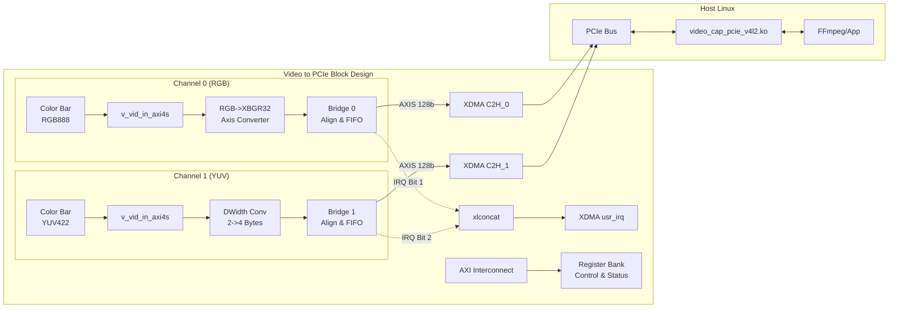
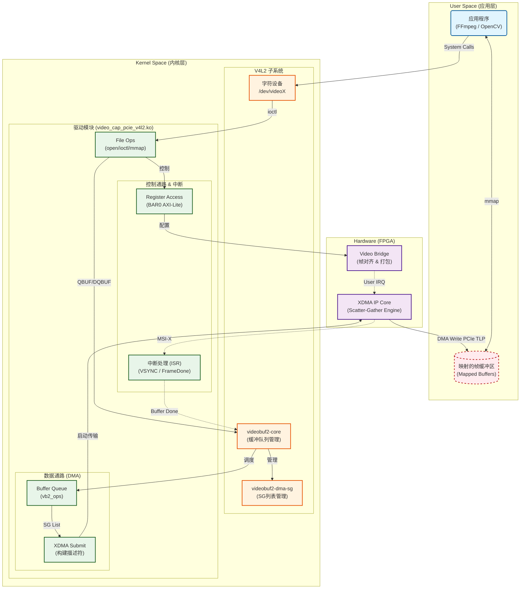

# PCIe 视频采集卡设计方案 (已实现)

## 1. 项目概述

### 1.1 目标

基于 Xilinx XC7K480TFFG1156-2 FPGA 设计一款 PCIe 视频采集卡。项目已完成 FPGA 逻辑开发与 Linux V4L2 驱动开发，实现无需官方 XDMA 驱动依赖的独立采集方案，支持多路视频输入与帧同步采集。

### 1.2 硬件平台

| 项目      | 规格                       | 备注                                  |
| --------- | -------------------------- | ------------------------------------- |
| FPGA 芯片 | XC7K480TFFG1156-2          | Kintex-7                              |
| PCIe 接口 | PCIe Gen2 x8               | 实际带宽约 2.8GB/s (理论 4.0GB/s)     |
| 开发工具  | Vivado 2024.2              | Block Design 流程                     |
| 视频源    | 内部彩条生成器             | 支持 RGB888 / YUV422 切换             |
| 驱动架构  | V4L2 + XDMA Core (In-Tree) | 单个 .ko 模块，无需安装官方 XDMA 驱动 |

### 1.3 核心特性 (已落地)

1.  **Block Design 架构**：采用 IP Integrator 设计，核心逻辑封装为 `video_cap_c2h_bridge` IP。
2.  **低延时采集**：使用 XDMA AXI Stream 接口 (C2H)，数据不经 DDR 缓存直接 DMA 到主机内存。
3.  **帧同步机制**：
    - FPGA 侧：基于 VSYNC 上升沿产生 User Interrupt。
    - 驱动侧：等待 VSYNC 中断后提交 DMA 请求，确保帧首对齐。
4.  **多通道支持**：
    - 目前实现双通道：Ch0 (RGB888 -> XBGR32) + Ch1 (YUV422)。
    - 支持独立中断映射 (Ch0->IRQ1, Ch1->IRQ2)。

---

## 2. 系统架构

### 2.1 整体 Block Design 架构

项目顶层使用 Vivado Block Design (`video_to_pcie.bd`) 实现，数据流如下：



### 2.2 关键模块说明

#### 2.2.1 视频采集桥接 (video_cap_c2h_bridge)

这是数据通路的“胶水”核心，负责将视频流适配到 PCIe DMA：

- **帧对齐 (Frame Alignment)**：检测 VSYNC/SOF 信号，确保每次 DMA 传输都从帧的第一个像素开始，解决“错位”问题。
- **深缓冲 (Deep FIFO)**：内置 64KB (4096 x 128-bit) BRAM FIFO，吸收 PCIe 总线的反压 (Backpressure)，防止视频输入端溢出。
- **中断产生**：在 VSYNC 上升沿产生脉冲信号（User IRQ），通知驱动一帧开始。
- **数据打包**：输入支持 32-bit (1 pixel)，输出打包为 128-bit (4 pixels) 供 XDMA 使用。

#### 2.2.2 寄存器组 (register_bank)

统一管理所有通道的控制信号，通过 AXI-Lite 接口访问：

- 控制：全局/通道使能、软复位、测试模式切换。
- 状态：PCIe 链路状态、FIFO 溢出标志、MIG 状态（如有）。

---

## 3. FPGA 详细设计

### 3.1 资源分配

- **BD 文件**: `fpga/project/video_cap.srcs/sources_1/bd/video_to_pcie/video_to_pcie.bd`
- **时钟域**:
  - `sys_clk_p/n` (100MHz): PCIe 参考时钟。
  - `axi_aclk` (125MHz): XDMA 导出时钟，用于 AXI-Lite 和 AXI-Stream 主数据通路。
  - `vid_pixel_clk` (148.5MHz): 视频像素时钟 (1080P60)。

### 3.2 通道配置 (当前实现)

|  通道   |  输入源   |   原始格式   | 处理                   |       最终格式 (DMA)        | IRQ 索引 | /dev/video |
| :-----: | :-------: | :----------: | :--------------------- | :-------------------------: | :------: | :--------: |
| **Ch0** | Color Bar | RGB888 (24b) | 补 0 扩展为 32b (XBGR) | 32-bit BGRX (Little Endian) |    1     |   video0   |
| **Ch1** | Color Bar | YUV422 (16b) | 宽度转换 2B->4B        | 16-bit YUYV (Little Endian) |    2     |   video1   |

### 3.3 中断映射架构

为了支持多路并发采集，不同通道必须使用独立的中断位：

- XDMA 配置启用 **4 个 User Interrupts**。
- **Bit 0**: 保留 / Frame Done (可选)。
- **Bit 1**: 通道 0 的 VSYNC (Frame Start)。
- **Bit 2**: 通道 1 的 VSYNC (Frame Start)。
- **Bit 3**: 保留。
- 驱动通过判断触发的中断位来唤醒对应通道的采集线程。

---

## 4. Linux 驱动架构 (V4L2)

### 4.1 驱动概览

- **路径**: `driver/v4l2/kmod/`
- **模块名**: `video_cap_pcie_v4l2.ko`
- **特点**:
  - **In-Tree XDMA**: 驱动源码直接包含了 Xilinx XDMA 的核心代码，编译为一个独立的 `.ko`，**不依赖**外部安装的 `xdma.ko`。
  - **V4L2 兼容**: 遵循 Linux V4L2 子系统标准，支持 `videobuf2` (vb2) 零拷贝 DMA。

### 4.2 软件栈架构

本方案采用 **Zero-Copy (零拷贝)** 架构，视频数据通过 PCIe DMA 直接进入用户态映射的内存，CPU 不参与数据搬运，仅负责调度。



#### 关键机制说明

- **V4L2/VB2 框架**：使用 `videobuf2-dma-sg` 管理非连续物理内存。驱动将分散的物理页（Scatter-Gather List）直接转换为 XDMA 描述符，实现硬件对虚拟内存的直接写入。
- **Embedded XDMA**: 驱动内部集成了 XDMA 核心逻辑 (`xdma_xfer_submit`)，直接操作硬件 C2H 通道，避免了函数调用开销。
- **精确帧同步**：
  - **开启流 (StreamOn)**：驱动只做准备，不立即启动硬件。
  - **VSYNC 中断**：FPGA 检测到场同步信号后触发中断。
  - **同步启动**：ISR 收到 VSYNC 后，立即提交首个 DMA 描述符。这确保了 DMA 传输总是严格从一帧的第一行开始，杜绝图像错位。

---

## 5. 项目文件结构

```
video_cap/
├── doc/
│   ├── 视频采集方案.md            # 本设计文档
│   └── implementation.md         # 详细实现落地说明
│
├── fpga/
│   ├── project/                  # Vivado 工程目录
│   │   └── video_cap.srcs/
│   │       └── sources_1/bd/video_to_pcie/  # 核心 Block Design
│   ├── src/
│   │   ├── hdl/bridge/           # 核心自研 IP: video_cap_c2h_bridge
│   │   └── hdl/common/           # 通用模块 (Register Bank)
│   └── constraints/              # 管脚与时序约束
│
└── driver/
    └── v4l2/                     # 正式发布的 V4L2 驱动
        ├── kmod/                 # 内核模块源码
        │   ├── xdma/             # 内嵌的 XDMA 核心源码
        │   ├── video_cap_*.c     # 驱动主要实现文件
        │   └── Makefile
        └── README.md             # 驱动使用指南
```

> **注**: `driver/test` 目录为早期调试残留，包含寄存器读写工具，正式发布时不使用。

---

## 6. 使用与验证指南

### 6.1 驱动编译与加载

```bash
# 1. 编译
cd driver/v4l2/kmod
make

# 2. 加载驱动
# num_channels: 创建的 video 节点数量
# c2h_channel: 起始 DMA 通道 (默认0)
# irq_index: 起始 VSYNC 中断号 (默认1, 对应 FPGA bit 1)
sudo insmod video_cap_pcie_v4l2.ko num_channels=2 c2h_channel=0 irq_index=1
```

### 6.2 验证设备

```bash
# 查看设备列表
v4l2-ctl --list-devices

# 查看通道 0 (RGB) 格式
v4l2-ctl -d /dev/video0 --list-formats-ext
# 预期输出: Pixel Format: 'XR24' (32-bit BGRX 8-8-8-8)

# 查看通道 1 (YUV) 格式
v4l2-ctl -d /dev/video1 --list-formats-ext
# 预期输出: Pixel Format: 'YUYV' (YUYV 4:2:2)
```

### 6.3 视频采集测试

**通道 0 (RGB888 转 BGRX32):**

```bash
# 设置格式
v4l2-ctl -d /dev/video0 --set-fmt-video=width=1920,height=1080,pixelformat=XR24

# FFplay 预览 (格式需指定为 bgr0)
ffplay -f v4l2 -video_size 1920x1080 -input_format bgr0 -i /dev/video0
```

**通道 1 (YUV422):**

```bash
# 设置格式
v4l2-ctl -d /dev/video1 --set-fmt-video=width=1920,height=1080,pixelformat=YUYV

# FFplay 预览
ffplay -f v4l2 -video_size 1920x1080 -input_format yuyv422 -i /dev/video1
```

---

## 7. 后续优化方向

1.  **动态分辨率支持**：目前 FPGA 写死 1080P60，后续可通过寄存器配置时序发生器。
2.  **外部视频源接入**：Block Design 中预留了接口，后续替换 `color_bar` 模块为 HDMI/SDI 输入 IP。
3.  **多路 DMA 性能调优**：在极高分辨率多路并发时，需关注 PCIe 带宽利用率与 TLast 打包策略。
